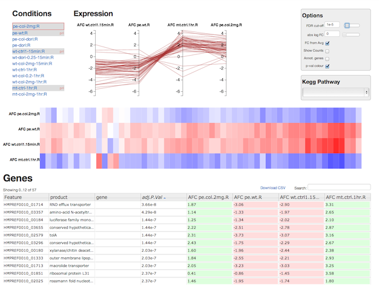

# DGE-Vis

* Visualise RNA-seq differential expression data.
* Perform your own DGE analysis, or use the inbuilt server to analyse from your own "counts" file.

Access a public web service running [DGE-Vis](http://www.vicbioinformatics.com/software.dge-vis.shtml).

View a [short video](https://www.youtube.com/watch?v=ucucQ_LtZ1g) of the interface in use.

## Example Screenshot

# Installation

If you do not want to use the [public DGE-Vis installation](http://www.vicbioinformatics.com/software.dge-vis.shtml), you may install your own.

You first need to grab a copy of DGE-Vis.

        git clone git@github.com:Victorian-Bioinformatics-Consortium/dge-vis

DGE-Vis can be installed in two ways:

  1. Perform your own DGE analysis, and use only the [web frontend from DGE-Vis](#frontend)
  2. Install the [frontend and backend software](#backend) to perform analysis and visualise the results.

## Frontend installation only

To use the frontend visualisation, you will need to have done your own DGE analysis with a tool like edgeR or voom.  You will need CSV file contain a line per gene, and the following columns:

  * ID - containing a unique identifier for each gene (required)
  * Adjusted p-value - The adjusted p-value (FDR or similar) for that gene (required)
  * Log intensity for each condition - Used to compute the log fold-change (required)
  * Gene info - Arbitrary information columns to display in the gene list table (optional)
  * Read counts - Read counts for each replicate, only used for display purposes (optional)

You need to create a `settings.js` file to specify the columns of you CSV file.  As an example, see the `examples/basic-settings.js`

## Full installation

Requirements:

  * GHC 6.12 or later
  * Python
  * CoffeeScript

It can be installed as an apache CGI site, or run in "dev" mode using a standalone python server.  Here we describe how to run in "dev" mode.

## Run tests locally

There are javascript tests which can be run locally.  Ensure you have compiled the CoffeeScript:

    coffee -c -o tests/js/js-build coffee
    coffee -c -o tests/js/js-build tests/js

Then you can either run the tests in your browser (navigate to http://localhost:8000/)

    (cd tests/js/ ; python -mSimpleHTTPServer)

Or, if you have <a href='http://phantomjs.org/'>phantomjs</a> installed you can run the tests from the command line: `./test-js.sh`

## Known Issues

#### Heatmap 

  * will only compute clustering (and be useful) if fewer than 4000 points.  Needs a faster algorithm
  * Clustering algorithm is naive greedy N^2.  So, not fast, and not a great clustering. 

#### Documentation

  * Installing the full backend is barely documented

